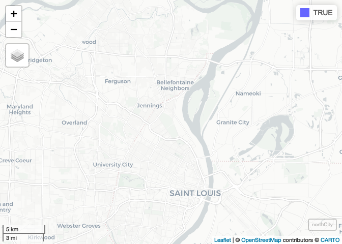

GIS-04 - Geoprocessing - Complete
================
Christopher Prener, Ph.D.
(October 07, 2020)

## Introduction

This notebook focuses on geoprocessing - the process of wrangling
geometric data. We’ll cover dissolves, intersects, clips, and working
with centroids.

## Dependencies

This notebook requires a variety of packages for working with spatial
data:

``` r
# tidyverse packages
library(dplyr)        # data wrangling
```

    ## Warning: package 'dplyr' was built under R version 4.0.2

    ## 
    ## Attaching package: 'dplyr'

    ## The following objects are masked from 'package:stats':
    ## 
    ##     filter, lag

    ## The following objects are masked from 'package:base':
    ## 
    ##     intersect, setdiff, setequal, union

``` r
# spatial packages
library(nngeo)        # geoprocessing tools
```

    ## Warning: package 'nngeo' was built under R version 4.0.2

    ## Loading required package: sf

    ## Warning: package 'sf' was built under R version 4.0.2

    ## Linking to GEOS 3.8.1, GDAL 3.1.1, PROJ 6.3.1

``` r
library(mapview)      # preview spatial data
```

    ## Warning: package 'mapview' was built under R version 4.0.2

    ## GDAL version >= 3.1.0 | setting mapviewOptions(fgb = TRUE)

``` r
library(sf)           # spatial data tools

# other packages
library(here)         # file path management
```

    ## here() starts at /Users/prenercg/GitHub/DSS/gis-04

## Load Data

First, we need to load up our data. This is review from the first
session, and so we’ve pre-filled the code for you. We’ll automatically
re-project the data as well (also review):

``` r
# point data - 2012 Homicides in St. Louis
homicides <- st_read(here("data", "STL_CRIME_Murders12", "STL_CRIME_Murders12.shp")) %>%
  st_transform(crs = 26915)
```

    ## Reading layer `STL_CRIME_Murders12' from data source `/Users/prenercg/GitHub/DSS/gis-04/data/STL_CRIME_Murders12/STL_CRIME_Murders12.shp' using driver `ESRI Shapefile'
    ## Simple feature collection with 119 features and 2 fields
    ## geometry type:  POINT
    ## dimension:      XY
    ## bbox:           xmin: 874691.8 ymin: 992644.3 xmax: 910223 ymax: 1051829
    ## projected CRS:  Transverse_Mercator

``` r
# point data - 2018 Public Schools in Missouri
schools <- st_read(here("data", "MO_EDU_PublicK12", "MO_EDU_PublicK12.shp")) %>%
  st_transform(crs = 26915)
```

    ## Reading layer `MO_EDU_PublicK12' from data source `/Users/prenercg/GitHub/DSS/gis-04/data/MO_EDU_PublicK12/MO_EDU_PublicK12.shp' using driver `ESRI Shapefile'
    ## Simple feature collection with 2381 features and 4 fields
    ## geometry type:  POINT
    ## dimension:      XY
    ## bbox:           xmin: -95.51797 ymin: 36.04236 xmax: -89.33608 ymax: 40.55136
    ## geographic CRS: GRS 1980(IUGG, 1980)

``` r
# polygon data 1 - St. Louis Voting Precincts
precincts <- st_read(here("data", "POL_WRD_2010_Prec", "POL_WRD_2010_Prec.shp"))%>%
  st_transform(crs = 26915)
```

    ## Reading layer `POL_WRD_2010_Prec' from data source `/Users/prenercg/GitHub/DSS/gis-04/data/POL_WRD_2010_Prec/POL_WRD_2010_Prec.shp' using driver `ESRI Shapefile'
    ## Simple feature collection with 233 features and 5 fields
    ## geometry type:  MULTIPOLYGON
    ## dimension:      XY
    ## bbox:           xmin: 871512.3 ymin: 982403 xmax: 915268.6 ymax: 1070966
    ## projected CRS:  Custom

``` r
# polygon data 2 - St. Louis Census Tracts
demos <- st_read(here("data", "STL_DEMOS_POP", "STL_DEMOS_POP.shp")) %>%
  st_transform(crs = 26915)
```

    ## Reading layer `STL_DEMOS_POP' from data source `/Users/prenercg/GitHub/DSS/gis-04/data/STL_DEMOS_POP/STL_DEMOS_POP.shp' using driver `ESRI Shapefile'
    ## Simple feature collection with 106 features and 5 fields
    ## geometry type:  POLYGON
    ## dimension:      XY
    ## bbox:           xmin: -90.32052 ymin: 38.53185 xmax: -90.16657 ymax: 38.77443
    ## geographic CRS: NAD83

## Dissolving Features

In our `precincts` data, we have a variable named `WARD10`. This is the
City Ward that each preinct falls within. If we wanted to map wards
instead of precincts, we can modify our geometric data using
`group_by()` and `summarise()`:

``` r
precincts %>%
  select(WARD10) %>%
  rename(ward = WARD10) %>%
  group_by(ward) %>%
  summarise() -> ward
```

    ## `summarise()` ungrouping output (override with `.groups` argument)

Once these have been dissolved, we can explore them with `mapview()`:

``` r
mapview(ward)
```

<!-- -->

Notice how some wards, such as Ward 4 and Ward 21 in North City, Ward 6
and Ward 7 in Downtown, and Wards 12, 15, and 23 in South City have
“holes.” These are common artifacts of the dissolve process that
result from precincts’ geometries not *perfectly* abutting each other.

The `nngeo` package has a great function `st_remove_holes()` that can be
used to get rid of these:

``` r
ward <- st_remove_holes(ward)
```

We can check out the differences with `mapview()`:

``` r
mapview(ward)
```

<!-- -->

We’re going to repeat this process, but this time we’ll combine a number
of the wards into a single polygon for “North City.”

``` r
## create vector
northCity <- c(1, 2, 3, 4, 5, 18, 21, 22, 26, 27)

## subset
ward %>%
  mutate(northCity = ifelse(ward %in% northCity, TRUE, FALSE)) %>%
  group_by(northCity) %>%
  summarise() %>%
  filter(northCity == TRUE) %>%
  st_remove_holes() -> northCity
```

    ## `summarise()` ungrouping output (override with `.groups` argument)

Let’s inspect these data again for holes with `mapview()`:

``` r
mapview(northCity)
```

<!-- -->

## Intersecting Data

We can use another geoprocessing technique, intersects, to identify
points that lie within our polygons. For instance, we can identify which
wards homicides occur in:

``` r
## intersect
homicides <- st_intersection(homicides, ward)
```

    ## Warning: attribute variables are assumed to be spatially constant throughout all
    ## geometries

``` r
## preview
head(homicides)
```

    ## Simple feature collection with 6 features and 3 fields
    ## geometry type:  POINT
    ## dimension:      XY
    ## bbox:           xmin: 738265.3 ymin: 4283067 xmax: 740289 ymax: 4285281
    ## projected CRS:  NAD83 / UTM zone 15N
    ##                date                  address ward                 geometry
    ## 7  01/16/2012 00:59          5020 SHREVE AVE    1   POINT (740289 4285281)
    ## 19 03/08/2012 11:38 5055 COTE BRILLIANTE AVE    1 POINT (738265.3 4283328)
    ## 22 03/17/2012 21:03          4973 MAFFITT PL    1 POINT (738728.9 4283721)
    ## 26 03/30/2012 18:00 3930 N KINGSHIGHWAY BLVD    1   POINT (739221 4284609)
    ## 30 04/09/2012 13:56         4942 WARWICK AVE    1 POINT (738514.4 4283067)
    ## 36 04/28/2012 20:18       5225 LEXINGTON AVE    1 POINT (738540.8 4284526)

We can also use this to subset our data, which is a related technique
sometimes called “clipping.” For example, our schools data covers the
entire State of Missouri. If we only wanted schools in the City of
St. Louis, we could intersect them:

``` r
## intersect
schoolsSTL <- st_intersection(schools, ward)
```

    ## Warning: attribute variables are assumed to be spatially constant throughout all
    ## geometries

``` r
## preview
head(schoolsSTL)
```

    ## Simple feature collection with 6 features and 5 fields
    ## geometry type:  POINT
    ## dimension:      XY
    ## bbox:           xmin: 738390.3 ymin: 4283132 xmax: 743695.7 ymax: 4289491
    ## projected CRS:  NAD83 / UTM zone 15N
    ##               id                      school                       address
    ## 96   115115-5100             Lexington Elem.         5030 Lexington Avenue
    ## 1027 115925-3910             Hawthorn Middle 1901 N Kingshighway Boulevard
    ## 1029 115925-1905        Hawthorn High School     1901 N. Kingshighway Blvd
    ## 1813 115913-6965 North Side Community School          3033 N Euclid Street
    ## 2135 115115-5610       Earl Nance, Sr. Elem.      8959 Riverview Boulevard
    ## 94   115115-4360                  Clay Elem.               3820 N 14th St.
    ##           city ward                 geometry
    ## 96   St. Louis    1   POINT (738801 4284238)
    ## 1027 St. Louis    1 POINT (738401.4 4283300)
    ## 1029 St. Louis    1 POINT (738390.3 4283282)
    ## 1813 St. Louis    1   POINT (739044 4284044)
    ## 2135 St. Louis    2 POINT (739848.9 4289491)
    ## 94   St. Louis    3 POINT (743695.7 4283132)

## Centroids

Another related geoprocessing task is using centroids to find out if
polygons lie within a larger polygon or not. We use their geometric
center, called a centroid, for this task. For instance, I may want to
know which census tracts lie within North City. To get a sense of how
these data change, we’ll start by previewing our `demos` data:

``` r
mapview(demos)
```

<!-- -->

We’ll start by calculating the geometric center (i.e. the centroid) for
all of our centroids:

``` r
## calculate centroids
demoCentroids <- st_centroid(demos)
```

    ## Warning in st_centroid.sf(demos): st_centroid assumes attributes are constant
    ## over geometries of x

``` r
## preview
mapview(demoCentroids)
```

<!-- -->

Notice that the attributes are totally preserved. Sometimes this is
ideal, other times it is not. For this example we’ll do is subset our
columns so that we only have `GEOID` remaining, and then intersect our
centroids with our `northCity` feature:

``` r
## subset and intersect
demoCentroids %>%
  select(GEOID) %>%
  st_intersection(., northCity) -> demoCentroids
```

    ## Warning: attribute variables are assumed to be spatially constant throughout all
    ## geometries

``` r
## preview
mapview(demoCentroids)
```

<!-- -->

There are two ways to get our `TRUE` indicator back into our data. One
is a “table join,” the other is to create a new column by referencing
our geoprocessed data. We’ll illustrate the join first:

``` r
## make a copy of our centroid data
demoCentroids2 <- demoCentroids

## remove geometry from centroids data
st_geometry(demoCentroids2) <- NULL

## preform table join
demos_modified <- left_join(demos, demoCentroids2, by = "GEOID")

## preview
head(demos_modified)
```

    ## Simple feature collection with 6 features and 6 fields
    ## geometry type:  POLYGON
    ## dimension:      XY
    ## bbox:           xmin: 733360 ymin: 4274925 xmax: 741440.9 ymax: 4283867
    ## projected CRS:  NAD83 / UTM zone 15N
    ##         GEOID          NAMELSAD     SQKM POP_E POP_M northCity
    ## 1 29510112100 Census Tract 1121 6.936664  4253   468        NA
    ## 2 29510116500 Census Tract 1165 0.904024  4590   525        NA
    ## 3 29510110300 Census Tract 1103 0.938287  1936   360      TRUE
    ## 4 29510103700 Census Tract 1037 0.910953  2406   215        NA
    ## 5 29510103800 Census Tract 1038 1.640334  3856   242        NA
    ## 6 29510104500 Census Tract 1045 1.939712  1990   225        NA
    ##                         geometry
    ## 1 POLYGON ((734633.3 4279479,...
    ## 2 POLYGON ((740098.5 4275728,...
    ## 3 POLYGON ((740110.8 4283146,...
    ## 4 POLYGON ((735225.3 4276168,...
    ## 5 POLYGON ((733360 4275146, 7...
    ## 6 POLYGON ((735553.7 4278190,...

Notice that tracts not in North City have `NA` value for the `northCity`
column. This isn’t ideal, so we’ll fill those `NA` values in with
`FALSE` values:

``` r
demos_modified <- mutate(demos_modified, northCity = ifelse(is.na(northCity) == TRUE, FALSE, northCity))
```

This is all pretty verbose, so we’ll illustrate a quicker way to apply
these data without a table join:

``` r
demos <- mutate(demos, northCity = ifelse(GEOID %in% demoCentroids$GEOID == TRUE, TRUE, FALSE))
```

This is far more succinct code, which means it is easier to debug and
trouble shoot\!
